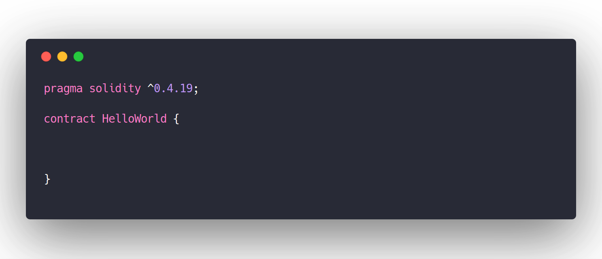

# Lesson 1: The Zombie Factory

In this lesson, we're supposed to build a "Zombie Factory" that generates an army of zombies. 

- The factory will maintain a database of all zombies in our army
```
Zombie[] public zombies;
```
- The factory will have a function for creating new zombies
```
function _createZombie(string _name, uint _dna) private {
        zombies.push(Zombie(_name, _dna));
    } 

```
- Each zombie will have a random and unique appearance
```
 function _generateRandomDna(string _str) private view returns (uint) {
        uint rand = uint(keccak256(_str));
        return rand % dnaModulus;
    }
```

## Zombie DNA
All zombies have DNA, which determines their appearance. It is a 16-bit integer:
```
8356281049284737
```
Like regular DNA, Zombie DNA is composed of *genes*, which correlate to specific traits. In our case, these genes are composed of 2 digits each. The first two digits map to the head type, the second two map to the color of the eyes, and so on:


## Smart Contract Boilerplate

Solidity code is mostly built around **smart contracts**. 

> A contract is the fundamental building block of Ethereum applications — all variables and functions belong to a contract, and this will be the starting point of all your projects.

Your solidity code should start like this:



## State Variables & Integers

Solidity doesn't use your average, run-of-the-mill variables. It uses... **State Variables**!

**State variables** are variables that are permanently stored in our contract's storage. This means they're written to the Ethereum blockchain :open_mouth::open_mouth:

Similarly, Solidity doesn't use just any old `int`, it uses `uint`s, or **Unsigned Integers**! This means that `uint`s are always non-negative.

> Note: In Solidity, `uint` is actually an alias for `uint256`, a 256-bit unsigned integer. You can declare `uint`s with less bits — `uint8`, `uint16`, `uint32`, etc.. But in general you want to simply use `uint` except in specific cases, which we'll talk about in later lessons.


## Structs

Solidity also allows you to create more complicated data types, such as `struct`s. So far, it looks like `struct`s behave the same as objects in JavaScript. Our zombies will all be represented as `struct`s.

```
struct Person {
  uint age;
  string name;
}
```

## Arrays 

There are two kinds of arrays in Solidity, **fixed arrays** and **dynamic arrays**:
```
// Array with a fixed length of 2 elements:
uint[2] fixedArray;
// another fixed Array, can contain 5 strings:
string[5] stringArray;
// a dynamic Array - has no fixed size, can keep growing:
uint[] dynamicArray;
```

## Private & Public Functions

The distinction between `private` and `public`is very important in Solidity.

When your function is `public`, anyone can call your contract's function and execute its code. This is obviously a huge security vulnerability, so its good practice to mark all your functions as `private` by default, and then only make those functiosn `public` that you want the world to be able to see.

Like so: 
```
function _addToArray(uint _number) private {
  numbers.push(_number);
}
```

## Function Modifiers: `view` & `pure`

You can add "modifiers" at the end of function declarations to mark them as `pure` or `view`. Regular functions read and modify contract data. `view` functions can only view, not modify, contract data. `pure` functions don't interact with the blockchain at all.

```
function _multiply(uint a, uint b) private pure returns (uint) {
  return a * b;
}
```

## Keccak256 and Typecasting

Ethereum has the hash function `keccak256` built in, which is a version of SHA3. It's useful for many purposes, but in our program, we'll mainly be using it for random number generation. 

Example:
```
//6e91ec6b618bb462a4a6ee5aa2cb0e9cf30f7a052bb467b0ba58b8748c00d2e5
keccak256("aaaab");
//b1f078126895a1424524de5321b339ab00408010b7cf0e6ed451514981e58aa9
keccak256("aaaac");
```

> Note: Secure random-number generation in blockchain is a very difficult problem. Our method here is insecure, but since security isn't top priority for our Zombie DNA, it will be good enough for our purposes.

## Events

The last contract we will be creating in this smart contract is an **event**. Events are a way for our smart contract to communicate that something happened on the blockchain to our app front-end, which can be 'listening' for certain events and take action when they happen.

In our case, we're going to create a `NewZombie` event that will notify our front-end web3.js that a new zombie has been created.

## zombiefactory.sol

At the end, our Solidity contract should look like this:

```
pragma solidity ^0.4.19;

contract ZombieFactory {

    event NewZombie(uint zombieId, string name, uint dna);

    uint dnaDigits = 16;
    uint dnaModulus = 10 ** dnaDigits;

    struct Zombie {
        string name;
        uint dna;
    }

    Zombie[] public zombies;

    mapping (uint => address) public zombieToOwner;
    mapping (address => uint) ownerZombieCount;

    function _createZombie(string _name, uint _dna) internal {
        uint id = zombies.push(Zombie(_name, _dna)) - 1;
        zombieToOwner[id] = msg.sender;
        ownerZombieCount[msg.sender]++;
        NewZombie(id, _name, _dna);
    }

    function _generateRandomDna(string _str) private view returns (uint) {
        uint rand = uint(keccak256(_str));
        return rand % dnaModulus;
    }

    function createRandomZombie(string _name) public {
        require(ownerZombieCount[msg.sender] == 0);
        uint randDna = _generateRandomDna(_name);
        _createZombie(_name, randDna);
    }

}

```

## Web3.js


Our contract is done! Now we just need a JS front-end that interacts with our solidity code. For this, we use one of Ethereum's libraries, **web3.js**. There's not enough space to explain web3.js in detail here, but for now we can just look at some sample code to get a feel for how it works and interacts with our code. 

```
// Here's how we would access our contract:
var abi = /* abi generated by the compiler */
var ZombieFactoryContract = web3.eth.contract(abi)
var contractAddress = /* our contract address on Ethereum after deploying */
var ZombieFactory = ZombieFactoryContract.at(contractAddress)
// `ZombieFactory` has access to our contract's public functions and events

// some sort of event listener to take the text input:
$("#ourButton").click(function(e) {
  var name = $("#nameInput").val()
  // Call our contract's `createRandomZombie` function:
  ZombieFactory.createRandomZombie(name)
})

// Listen for the `NewZombie` event, and update the UI
var event = ZombieFactory.NewZombie(function(error, result) {
  if (error) return
  generateZombie(result.zombieId, result.name, result.dna)
})

// take the Zombie dna, and update our image
function generateZombie(id, name, dna) {
  let dnaStr = String(dna)
  // pad DNA with leading zeroes if it's less than 16 characters
  while (dnaStr.length < 16)
    dnaStr = "0" + dnaStr

  let zombieDetails = {
    // first 2 digits make up the head. We have 7 possible heads, so % 7
    // to get a number 0 - 6, then add 1 to make it 1 - 7. Then we have 7
    // image files named "head1.png" through "head7.png" we load based on
    // this number:
    headChoice: dnaStr.substring(0, 2) % 7 + 1,
    // 2nd 2 digits make up the eyes, 11 variations:
    eyeChoice: dnaStr.substring(2, 4) % 11 + 1,
    // 6 variations of shirts:
    shirtChoice: dnaStr.substring(4, 6) % 6 + 1,
    // last 6 digits control color. Updated using CSS filter: hue-rotate
    // which has 360 degrees:
    skinColorChoice: parseInt(dnaStr.substring(6, 8) / 100 * 360),
    eyeColorChoice: parseInt(dnaStr.substring(8, 10) / 100 * 360),
    clothesColorChoice: parseInt(dnaStr.substring(10, 12) / 100 * 360),
    zombieName: name,
    zombieDescription: "A Level 1 CryptoZombie",
  }
  return zombieDetails
}
```
